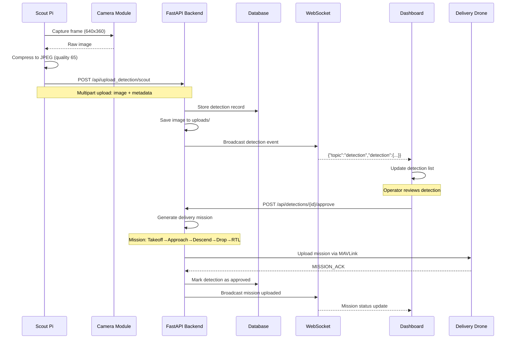

# NIDAR Workflows & Frontend Guide

This document explains the complete object detection workflow, autonomous mission generation, and frontend capabilities of the NIDAR system.

---

## Object Detection Workflow

### Overview

The object detection workflow follows this sequence:

```
Scout Drone → Capture Image → Upload to VPS → Operator Review → Approval → Mission Generation → Delivery Execution
```

### Detailed Flow



### Step-by-Step Breakdown

#### 1. Image Capture (Scout Pi)

**File:** [`pis/scout/scout_main.py`](file:///D:/Nidar/pis/scout/scout_main.py)

```python
def capture_and_upload():
    # Open camera
    cap = cv2.VideoCapture(CAPTURE_DEVICE)
    ret, frame = cap.read()
    cap.release()
    
    # Resize for bandwidth efficiency
    small = cv2.resize(frame, (640, 360))
    
    # Compress to JPEG
    _, jpg = cv2.imencode('.jpg', small, [int(cv2.IMWRITE_JPEG_QUALITY), 65])
    
    # Prepare metadata
    meta = {
        "lat": None,  # TODO: Get from MAVLink GLOBAL_POSITION_INT
        "lon": None,  # TODO: Get from MAVLink GLOBAL_POSITION_INT
        "conf": 0.0   # TODO: Get from object detection model
    }
    
    # Upload to VPS
    files = {'image': ('detection.jpg', jpg.tobytes(), 'image/jpeg')}
    r = requests.post(
        f"{VPS_URL}/api/upload_detection/{VEHICLE_ID}",
        files=files,
        data={'meta': json.dumps(meta)},
        timeout=30
    )
```

**Enhancement Points:**
- Add object detection model (YOLO/TensorflowLite) before upload
- Extract GPS coordinates from MAVLink telemetry
- Only upload when object is detected (reduce bandwidth)

#### 2. Detection Upload (Backend)

**File:** [`backend/vps_app.py`](file:///D:/Nidar/backend/vps_app.py#L218-L247)

```python
@app.post("/api/upload_detection/{vehicle_id}")
async def upload_detection(
    vehicle_id: str,
    image: UploadFile = File(...),
    meta: str = Form(None)
):
    # Save image
    fname = f"{vehicle_id}_{int(time.time() * 1000)}_{image.filename}"
    path = os.path.join(UPLOAD_DIR, fname)
    async with aiofiles.open(path, 'wb') as f:
        await f.write(await image.read())
    
    # Parse metadata
    meta_j = json.loads(meta) if meta else {}
    
    # Create detection record
    rec = {
        "id": len(DETECTIONS) + 1,
        "vehicle_id": vehicle_id,
        "lat": meta_j.get("lat"),
        "lon": meta_j.get("lon"),
        "conf": meta_j.get("conf"),
        "img": f"/uploads/{fname}",
        "ts": int(time.time() * 1000),
        "approved": False
    }
    DETECTIONS.append(rec)
    
    # Broadcast to all connected clients
    await ws_send(vehicle_id, {"topic": "detection", "detection": rec})
```

#### 3. Dashboard Display (Frontend)

**File:** [`backend/templates/dashboard.html`](file:///D:/Nidar/backend/templates/dashboard.html#L240-L265)

```javascript
function handleWSMessage(vehicleId, data) {
    if (data.topic === 'detection') {
        logConsole(`New detection from ${vehicleId}!`);
        loadDetections();  // Refresh detection list
    }
}
```

The detection appears in the "Recent Detections" widget with pending status.

#### 4. Operator Review & Approval

**File:** [`backend/templates/detection_panel.html`](file:///D:/Nidar/backend/templates/detection_panel.html)

Operator navigates to `/detections` page:
- Views detection image thumbnail
- Sees GPS coordinates and confidence
- Clicks "Approve & Dispatch" button
- Selects delivery drone from modal
- Confirms approval

```javascript
function confirmApproval() {
    const deliveryVehicle = document.getElementById('delivery-select').value;
    
    fetch(`/api/detections/${currentDetectionId}/approve`, {
        method: 'POST',
        headers: {'Content-Type': 'application/json'},
        body: JSON.stringify({delivery_vehicle_id: deliveryVehicle})
    })
    .then(r => r.json())
    .then(data => {
        alert('Detection approved! Mission uploaded to delivery drone.');
    });
}
```

---

## Autonomous Mission Generation

### Mission Generation Logic

**File:** [`backend/vps_app.py`](file:///D:/Nidar/backend/vps_app.py#L309-L354)

```python
def generate_delivery_mission_simple(
    detection: dict,
    delivery_alt: float = 60,
    approach_alt: float = 25,
    drop_alt: float = 5,
    climb_alt: float = 60
):
    lat = detection['lat']
    lon = detection['lon']
    mission = []
    
    # 1. Takeoff to delivery altitude
    mission.append({
        "seq": 0,
        "frame": 0,
        "command": 22,  # MAV_CMD_NAV_TAKEOFF
        "x": lat, "y": lon, "z": delivery_alt
    })
    
    # 2. Approach waypoint
    mission.append({
        "seq": 1,
        "frame": 0,
        "command": 16,  # MAV_CMD_NAV_WAYPOINT
        "x": lat, "y": lon, "z": approach_alt
    })
    
    # 3. Descend to drop altitude
    mission.append({
        "seq": 2,
        "frame": 0,
        "command": 16,
        "x": lat, "y": lon, "z": drop_alt
    })
    
    # 4. Trigger servo (drop package)
    mission.append({
        "seq": 3,
        "frame": 0,
        "command": 183,  # MAV_CMD_DO_SET_SERVO
        "param1": 9,      # Servo channel 9
        "param2": 1500,   # PWM value (open)
        "x": 0, "y": 0, "z": 0
    })
    
    # 5. Climb back up
    mission.append({
        "seq": 4,
        "frame": 0,
        "command": 16,
        "x": lat, "y": lon, "z": climb_alt
    })
    
    # 6. Return to Launch
    mission.append({
        "seq": 5,
        "frame": 0,
        "command": 20   # MAV_CMD_NAV_RETURN_TO_LAUNCH
    })
    
    return mission
```

### Mission Sequence Visualization

```
   Start (Home)
       |
       | 1. TAKEOFF (60m)
       ↓
   Cruise Alt (60m)
       |
       | 2. FLY TO TARGET
       ↓
   Approach (25m)
       |
       | 3. DESCEND
       ↓
   Drop Alt (5m)
       |
       | 4. TRIGGER SERVO (drop package)
       ↓
   Drop Alt (5m)
       |
       | 5. CLIMB
       ↓
   Safe Alt (60m)
       |
       | 6. RETURN TO LAUNCH
       ↓
   Home (Land)
```

### Mission Upload to Drone

**File:** [`backend/vps_app.py`](file:///D:/Nidar/backend/vps_app.py#L356-L394)

```python
@app.post("/api/detections/{detection_id}/approve")
async def approve_detection(detection_id: int, payload: dict):
    # Get detection
    det = next((d for d in DETECTIONS if d['id'] == detection_id), None)
    
    # Generate mission
    mission = generate_delivery_mission_simple(det)
    
    # Upload to delivery drone via MAVLink
    conn = MAVLINK_CONNS.get(delivery_port)
    hb = conn.recv_match(type='HEARTBEAT', blocking=True, timeout=5)
    tsys = hb.get_srcSystem()
    
    # Use mission_utils.upload_mission
    ok = await asyncio.get_event_loop().run_in_executor(
        None, upload_mission, conn, tsys, mission, 0, 12.0
    )
    
    # Mark as approved
    det['approved'] = True
    
    # Broadcast success
    await ws_send(delivery, {"topic": "mission_uploaded", "mission": mission})
```

### Mission Execution

Once uploaded, the mission can be started:

**Via Dashboard:**
- Click "Start Mission" button on delivery drone card
- Sends `mode AUTO` command to drone

**Via MAVProxy (SITL):**
```bash
mode AUTO
arm throttle
```

The drone will:
1. Auto-arm and takeoff
2. Fly to each waypoint in sequence
3. Drop package when reaching drop altitude
4. Return home and land

---

## Frontend Architecture

### Overview

The frontend uses **server-rendered HTML** with **HTMX** for dynamic updates and **WebSocket** for real-time telemetry.

**Technology Stack:**
- **Templates**: Jinja2 (Python)
- **Dynamic Updates**: HTMX 1.9.10
- **Real-time**: WebSocket (native FastAPI)
- **Styling**: Vanilla CSS with modern gradients

### Page Structure

```
┌─────────────────────────────────────┐
│         Landing Page                │
│        /  (index.html)              │
│  - Hero section with features       │
│  - "Launch Dashboard" CTA           │
└─────────────────────────────────────┘
              ↓
┌─────────────────────────────────────┐
│      Main Dashboard                 │
│   /dashboard (dashboard.html)       │
│                                     │
│  ┌─────────────┬─────────────┐     │
│  │ Scout Card  │ Delivery Card│     │
│  │ - Telemetry │ - Telemetry  │     │
│  │ - Controls  │ - Controls   │     │
│  └─────────────┴─────────────┘     │
│                                     │
│  ┌──────────────────────────┐      │
│  │  Recent Detections       │      │
│  │  (last 3 thumbnails)     │      │
│  └──────────────────────────┘      │
│                                     │
│  ┌──────────────────────────┐      │
│  │  System Console          │      │
│  │  (live logs)             │      │
│  └──────────────────────────┘      │
└─────────────────────────────────────┘
              ↓
┌─────────────────────────────────────┐
│    Detection Management             │
│  /detections (detection_panel.html) │
│                                     │
│  ┌────┬────┬────┬────┐             │
│  │Det1│Det2│Det3│Det4│ ...         │
│  └────┴────┴────┴────┘             │
│  - Grid view of all detections      │
│  - Approve button per detection     │
│  - Status badges (pending/approved) │
└─────────────────────────────────────┘
```

### Real-time Features

#### 1. WebSocket Connection

**File:** [`backend/templates/dashboard.html`](file:///D:/Nidar/backend/templates/dashboard.html#L156-L182)

```javascript
function connectWebSocket(vehicleId) {
    const ws = new WebSocket(`ws://${window.location.host}/ws/${vehicleId}`);
    
    ws.onopen = () => {
        logConsole(`${vehicleId} WebSocket connected`);
    };
    
    ws.onmessage = (event) => {
        const data = JSON.parse(event.data);
        handleWSMessage(vehicleId, data);
    };
    
    ws.onclose = () => {
        logConsole(`${vehicleId} WebSocket disconnected, reconnecting...`);
        setTimeout(() => connectWebSocket(vehicleId), 2000);
    };
    
    return ws;
}
```

#### 2. Message Handling

**Message Types:**

| Topic | Data | Action |
|-------|------|--------|
| `telemetry` | `{lat, lon, alt, ts}` | Update position display |
| `heartbeat` | `{sysid, ts}` | Update connection status |
| `statustext` | `{text, ts}` | Append to console log |
| `mission_current` | `{seq, ts}` | Update waypoint index |
| `detection` | `{detection: {...}}` | Add to detection list |
| `mission_uploaded` | `{mission: [...]}` | Show notification |

```javascript
function handleWSMessage(vehicleId, data) {
    const prefix = vehicleId === 'scout' ? 'scout' : 'delivery';
    
    if (data.topic === 'telemetry') {
        // Update position
        document.getElementById(`${prefix}-lat`).textContent = 
            data.data.lat.toFixed(6);
        document.getElementById(`${prefix}-lon`).textContent = 
            data.data.lon.toFixed(6);
        document.getElementById(`${prefix}-alt`).textContent = 
            data.data.alt.toFixed(1) + ' m';
    } 
    else if (data.topic === 'statustext') {
        // Add to console
        logConsole(`[${vehicleId}] ${data.text}`);
    }
    else if (data.topic === 'mission_current') {
        // Update mission progress
        document.getElementById('delivery-wp').textContent = data.seq;
    }
}
```

#### 3. Dashboard Components

**Vehicle Cards:**
- Live telemetry display (lat/lon/alt/battery)
- Connection status indicator (pulsing green dot)
- Control buttons (Fetch Mission, RTL)

**Detection Widget:**
- Shows last 3 detections
- Pending/Approved badges
- Click to view full detection panel

**System Console:**
- Matrix-style green-on-black terminal
- Timestamped log entries
- Auto-scrolls to bottom

### UI/UX Features

#### Modern Design Elements

**Gradient Backgrounds:**
```css
background: linear-gradient(135deg, #667eea 0%, #764ba2 100%);
```

**Glassmorphism Cards:**
```css
background: rgba(255,255,255,0.1);
backdrop-filter: blur(10px);
```

**Smooth Animations:**
```css
.btn:hover {
    transform: translateY(-2px);
    box-shadow: 0 4px 12px rgba(102, 126, 234, 0.4);
}
```

**Status Indicators:**
```css
@keyframes pulse {
    0%, 100% { opacity: 1; }
    50% { opacity: 0.5; }
}
```

#### Responsive Layout

All pages use CSS Grid for responsive layouts:
```css
.dashboard-grid {
    display: grid;
    grid-template-columns: repeat(auto-fit, minmax(350px, 1fr));
    gap: 2rem;
}
```

---

## API Integration

### Frontend → Backend Communication

#### REST API Calls

```javascript
// Fetch mission from drone
function fetchMission(vehicleId) {
    fetch(`/api/vehicles/${vehicleId}/mission-fetch`, {
        method: 'POST'
    })
    .then(r => r.json())
    .then(data => {
        logConsole(`Fetching mission from ${vehicleId}...`);
    });
}

// Approve detection
function confirmApproval() {
    fetch(`/api/detections/${currentDetectionId}/approve`, {
        method: 'POST',
        headers: {'Content-Type': 'application/json'},
        body: JSON.stringify({
            delivery_vehicle_id: deliveryVehicle
        })
    })
    .then(r => r.json())
    .then(data => {
        alert('Mission uploaded!');
        loadDetections();
    });
}
```

#### WebSocket Subscriptions

```javascript
// Initialize connections on page load
scoutWS = connectWebSocket('scout');
deliveryWS = connectWebSocket('delivery');

// Auto-refresh detection list
setInterval(loadDetections, 10000);  // Every 10 seconds
```

---

## User Workflows

### Workflow 1: Scout Detection → Delivery Mission

1. **Scout captures image** (automatic, every 5s)
2. **Detection appears in dashboard** (WebSocket push)
3. **Operator navigates to /detections**
4. **Reviews detection image and coordinates**
5. **Clicks "Approve & Dispatch"**
6. **Selects delivery drone**
7. **Confirms approval**
8. **Backend generates mission** (6 waypoints)
9. **Mission uploaded to delivery drone** (MAVLink)
10. **Operator starts mission** (mode AUTO)
11. **Drone executes mission** (real-time progress in dashboard)
12. **Package dropped at target**
13. **Drone returns home**

### Workflow 2: Manual Mission Upload

1. **Operator clicks "Fetch Mission"** on delivery card
2. **Backend sends MISSION_REQUEST_LIST** to drone
3. **Drone responds with mission items**
4. **Mission cached in backend**
5. **Operator can modify mission JSON**
6. **Click "Upload Mission"**
7. **Backend sends MISSION_COUNT → MISSION_ITEM_INT**
8. **Drone acknowledges** (MISSION_ACK)

---

## Enhancement Opportunities

### Object Detection Integration

**Add YOLO/TensorflowLite to Scout:**

```python
# scout_main.py enhancement
import tflite_runtime.interpreter as tflite

def detect_objects(frame):
    # Load model
    interpreter = tflite.Interpreter(model_path="model.tflite")
    interpreter.allocate_tensors()
    
    # Preprocess
    input_data = preprocess(frame)
    interpreter.set_tensor(input_details[0]['index'], input_data)
    
    # Run inference
    interpreter.invoke()
    
    # Get results
    boxes = interpreter.get_tensor(output_details[0]['index'])
    scores = interpreter.get_tensor(output_details[1]['index'])
    
    # Filter by confidence
    detections = [(box, score) for box, score in zip(boxes, scores) 
                  if score > 0.7]
    
    return detections

def capture_and_upload():
    frame = capture()
    detections = detect_objects(frame)
    
    if len(detections) > 0:
        # Only upload when object detected
        upload(frame, detections)
```

### GPS Integration

**Extract coordinates from MAVLink:**

```python
# scout_main.py enhancement
from pymavlink import mavutil

mav = mavutil.mavlink_connection('udp:127.0.0.1:14550')

def get_gps_position():
    msg = mav.recv_match(type='GLOBAL_POSITION_INT', blocking=True, timeout=5)
    if msg:
        lat = msg.lat / 1e7
        lon = msg.lon / 1e7
        alt = msg.alt / 1000.0
        return lat, lon, alt
    return None, None, None

def capture_and_upload():
    frame = capture()
    lat, lon, alt = get_gps_position()
    
    meta = {"lat": lat, "lon": lon, "conf": 0.95}
    upload(frame, meta)
```

### Advanced Mission Planning

**Multi-waypoint delivery:**

```python
def generate_delivery_mission_advanced(detection, delivery_home):
    mission = []
    
    # 1. Takeoff from delivery home
    # 2. Waypoints to avoid obstacles
    # 3. Spiral approach to target
    # 4. Precision descent with GPS hold
    # 5. Package drop with confirmation
    # 6. Return via different route
    # 7. Land at original home
    
    return mission
```

---

## Summary

The NIDAR system provides a complete end-to-end solution:

✅ **Object Detection**: Scout drone captures and uploads detections  
✅ **Operator Review**: Web dashboard for detection management  
✅ **Auto Mission Gen**: Backend creates delivery missions from detections  
✅ **MAVLink Integration**: Seamless communication with ArduPilot  
✅ **Real-time Updates**: WebSocket telemetry streaming  
✅ **Modern UI**: Server-rendered templates with HTMX  

All pieces are implemented and working together!
